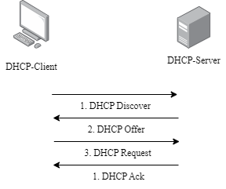

# FreeIP

## Список используемых сокращений
- БД – База данных
- КТВ – Кабельное телевидение
- ПО – Программное обеспечение
- СУБД – Система управления базами данных
- ШПД – Широкополосная передача данных
- DHCP – Dynamic Host Configuration Protocol
- IP – Internet Protocol
- MAC – Media Access Control
- SQL – Structured Query Language
## Тема проекта:
Интеграция системы учета Абонентов оператора связи ATIRRA (биллинг) с ISC-DHCP-SERVER сервером (dhcp-сервер) выдачи IP адресов Абонентам и автоматизация процесса управления доступом Абонентов к сети интернет.
## Цель:
Автоматизировать механизм выдачи IP адресов Абонентам, реализовать управление доступом Абонентов к сети интернет на основании данных из ATIRRA и таким образом исключить возможность несанкционированного доступа к сети интернет путем отключения пользователей в единой системе ATIRRA.
## Проблема
По причине того, что имеющаяся Интегрированная система ATIRRA, которая является приложением для работы с абонентами Кабельного и Цифрового телевидения, и не адаптирована для работы с абонентами сетей ШПД, не решает ряд проблем. Полноценное управление пользователями сети ШПД невозможно, а возможен только учет Абонентов. На текущий момент ограничение доступа Абонентов к сети интернет происходит путем выключения порта на оборудовании. Данный метод имеет много недостатков, таких как:
1)	Ошибки при отключении портов. Забывание сохранения конфигурации;
2)	Наличие уникальных конфигураций оборудования;
3)	Для блокировки Абонентов должны привлекаться технические специалисты с доступом к оборудованию, отключение не могут произвести операторы ATIRRA;
4)	Увеличенная нагрузка на специалистов технической поддержки;
5)	Несвоевременная оплата Абонентами услуг интернет;
6)	Наличие неплательщиков которым по ошибке забыли во время отключить порт на оборудовании;
7)	Потенциальное злоупотребление сотрудниками технической поддержки управлением доступом Абонентов к сети интернет (предоставление бесплатного доступа друзьям и знакомым, продажа услуги «мимо кассы»);

## Немного теории

### ATIRRA
Это интегрированная система, предназначенная для комплексного управления Абонентскими сетями операторов кабельного и цифрового телевидения. Она предоставляет широкий спектр функций, обеспечивающих высокую эффективность работы операторов.
Автор приложения предоставил доступ к исходникам более современной программе всем желающим и они доступны на [GitHub.com](https://github.com/dshumko/a4on.tv "A4ON").
В качестве базы данных приложение ATIRRA использует FIREBIRD. 

### DHCP сервер
Для распределения IP адресов между устройствами сети наиболее часто используется протокол DHCP (Dynamic Host Configuration Protocol). Так-же с помощью этого протокола можно передавать устройствам различные параметры с использованием опций. Данный протокол работает по модели «клиент-сервер». Для автоматической конфигурации компьютер-клиент на этапе конфигурации сетевого устройства обращается к так называемому серверу DHCP и получает от него нужные параметры. Протокол использует порт UDP/67 на стороне сервера и порт UDP/68 на стороне клиента.
Процесс получения адрес происходит следующим образом:




- Обнаружение DHCP: В начале клиент выполняет широковещательный запрос по всей физической сети с целью обнаружить доступные DHCP-серверы. Он отправляет сообщение типа DHCPDISCOVER (значение опции «Тип сообщения» - 1), при этом в качестве IP-адреса источника указывается 0.0.0.0 (если компьютер ещё не имеет собственного IP-адреса), а в качестве адреса назначения - широковещательный адрес 255.255.255.255. Сообщение DHCPDISCOVER может быть распространено за пределы локальной физической сети при помощи специально настроенных агентов ретрансляции DHCP, перенаправляющих поступающие от клиентов сообщения DHCP серверам в других подсетях.
- Предложение DHCP: Получив сообщение от клиента, сервер определяет требуемую конфигурацию клиента в соответствии с указанными сетевым администратором настройками. В данном случае DHCP-сервер согласен с запрошенным клиентом адресом 192.168.1.100. Сервер отправляет ему ответ DHCPOFFER (значение опции «Тип сообщения» — 2), в котором предлагает конфигурацию. Это сообщение DHCP-сервер отправляет хосту, пославшему DHCPDISCOVER, на его MAC, при определенных обстоятельствах сообщение может распространяться как широковещательная рассылка. Клиент может получить несколько различных предложений DHCP от разных серверов; из них он должен выбрать то, которое его «устраивает»
- Запрос DHCP: Выбрав одну из конфигураций, предложенных DHCP-серверами, клиент отправляет запрос DHCPREQUEST (значение опции «Тип сообщения» — 3). Он рассылается широковещательно; при этом к опциям, указанным клиентом в сообщении DHCPDISCOVER, добавляется специальная опция — идентификатор сервера — указывающая адрес DHCP-сервера, выбранного клиентом (в данном случае — 192.168.1.1).
Этот же запрос используется, когда время аренды адреса подходит к концу, для продления времени (renewing) или процедуры перепривязки (rebinding). В этих случаях опции «идентификатор сервера» и «запрошенный IP-адрес» не указываются, а поле ciaddr заполняется ранее назначенным адресом клиента. В случае продления времени запрос отправляется не широковещательно, а адресно на выдавший сервер. Только если сервер не отвечает в течение отведённого времени, инициируется процедура перепривязки с широковещательными запросами.
Также запрос используется для инициализации после перезагрузки клиента (init-reboot), когда ему уже известен ранее назначенный адрес. В таком случае DHCPDISCOVER не выполняется, а сразу отсылается широковещательный DHCPREQUEST без указания опции «идентификатор сервера», но с известным адресом в опции «запрошенный IP-адрес». Поле ciaddr остаётся пустым.
- Подтверждение DHCP. Наконец, сервер подтверждает запрос и направляет подтверждение DHCPACK (значение опции «Тип сообщения» — 5) клиенту. После этого клиент должен настроить свой сетевой интерфейс, используя предоставленные опции.

### DHCP Option 82 

Для управления Абонентами и контроля выдачи IP адресом мы используем опцию 82. Это опция протокола DHCP, использующаяся для того чтобы проинформировать DHCP-сервер о том, от какого DHCP-ретранслятора и через какой его порт был получен запрос. Применяется при решении задачи привязки IP-адреса к порту коммутатора и для защиты от атак с использованием протокола DHCP (DHCP snooping).

__Option 82__ состоит из двух подопций:

__Agent Circuit ID__ - содержит информацию о том, с какого порта пришел запрос на DHCP-ретранслятор.

__Agent Remote ID__ - идентификатор самого DHCP-ретранслятора (который задается при настройке, можно например использовать MAC или IP -адреса коммутатора или его описание, любое удобное значение).

Одним из наиболее популярных решений для решения этой задачи и выбранной нами для работы является ISC-DHCP-Server (Internet Systems Consortium Dynamic Host Configuration Protocol Server). Этот сервер используется для автоматического назначения IP-адресов и других сетевых конфигураций клиентским устройствам в сети.

Управление конфигурацией сервера происходит через текстовые конфигурационные файлы.
Основной конфигурационный файл dhcpd.conf используется для настройки ISC-DHCP-Server. В этом файле определяются глобальные параметры сервера, параметры подсетей и конкретных хостов. Так-же в этом файле можно указать ссылку на другие конфигурационные файлы.
Пример структуры файла __dhcpd.conf__:

```
# Глобальные параметры
default-lease-time 600;
max-lease-time 7200;
include "/etc/dhcp/classes.conf";

# Параметры подсети
subnet 192.168.1.0 netmask 255.255.255.0 {
    range 192.168.1.10 192.168.1.100;
    option routers 192.168.1.1;
    option domain-name-servers 192.168.1.1, 192.168.1.2;
}

# Параметры аренды для конкретного хоста
host workstation1 {
    hardware ethernet 00:0c:29:6d:8c:70;
    fixed-address 192.168.1.50;
}

```

Для отслеживания арендованных IP-адресов используется файл __dhcpd.leases__. Он содержит записи о текущих и прошлых арендах, включая информацию о времени начала и
Пример записи аренды в __dhcpd.leases__:
```
lease 192.168.0.101 {
starts epoch 1717491598; # Tue Jun 04 11:59:58 2024
ends epoch 1717495198; # Tue Jun 04 12:59:58 2024
cltt epoch 1717491598; # Tue Jun 04 11:59:58 2024
binding state active;
next binding state free;
rewind binding state free;
hardware ethernet 28:28:5d:e7:6b:b3;
uid "\001((]\347k\263";
set vendor-class-identifier = "ndhcpc";
option agent.circuit-id 0:2:0:e;
option agent.remote-id 1:c:31:37:32:2e:31:36:2e:30:2e:32:31:32;
client-hostname "Keenetic_Start";
}
```

Так-же ISC-DHCP-Server реализован удобный механизм классов. Классы используются для группировки клиентов с общими характеристиками. Это позволяет применять к ним одинаковые параметры конфигурации. Класс определяется с использованием директивы class. Внутри директивы указываются параметры и условия, которые должны выполняться для клиентов данного класса.
```
class "example-class" {
    match if substring (hardware, 1, 3) = 00:0c:29;
}
```

После определения класса можно указать параметры, которые будут применяться ко всем клиентам, соответствующим условиям класса.
```
subnet 192.168.1.0 netmask 255.255.255.0 {
    pool {
        allow members of "example-class";
        range 192.168.1.200 192.168.1.250;
    }
    option routers 192.168.1.1;
    option domain-name-servers 192.168.1.1, 192.168.1.2;
}
```

Условие совпадения match if используется сервером для идентификации клиентов, которые принадлежат к определенному классу. В примере выше условие проверяет первые три байта MAC-адреса клиента. В этом примере клиенты с первыми тремя байтами MAC-адреса 00:0c:29 будут идентифицированы как "example-class" и получат IP-адреса из диапазона 192.168.1.200-192.168.1.250.
```
subnet 192.168.1.0 netmask 255.255.255.0 {
    pool {
        allow members of "example-class";
        range 192.168.1.200 192.168.1.250;
    }
    option routers 192.168.1.1;
    option domain-name-servers 192.168.1.1, 192.168.1.2;
}
Условие совпадения match if используется сервером для идентификации клиентов, которые принадлежат к определенному классу. В примере выше условие проверяет первые три байта MAC-адреса клиента. В этом примере клиенты с первыми тремя байтами MAC-адреса 00:0c:29 будут идентифицированы как "example-class" и получат IP-адреса из диапазона 192.168.1.200-192.168.1.250.

# Укажите адрес, на который DHCP-сервер ожидает получать запросы (адрес DHCP-сервера)

local-address 192.168.2.9;

# Укажите подсеть интерфейса, на котором запущен DHCP-сервер

subnet 192.168.2.0 netmask 255.255.255.0 {
}

# Если сервер получит запрос, содержащий опцию 82, он сгенерирует сообщение в системный журнал
# 

if exists agent.circuit-id
{
log (info, concat( " Lease for ", 
                     binary-to-ascii (10, 8, ".", leased-address),
                     " Switch port: ", 
                     binary-to-ascii (10, 8, ".", option agent.circuit-id), 
                     " Switch MAC: ",
                     binary-to-ascii(16, 8, ".", option agent.remote-id)));
}

# Запросы, пришедшие с 5го порта коммутатора: 
class "port-5"
{
 match if binary-to-ascii (10, 8, "", suffix( option agent.circuit-id, 1)) = "5";
}

# Адрес для 5го порта: 
pool {
  range 192.168.1.55;
  allow members of "port-5";
}
```
## Описание работы приложения
Приложение выполняет функцию присвоения IP адресов абонентам и контроля правильности выдачи адресов. Управление IP адресами происходит на основании конфигурационных файлов и данных из БД ATIRRA. Работа в интерфейсе ATIRRA позволяет включать и выключать услугу абоненту, а так-же изменять присвоенных IP адрес, коммутатор и порт подключения. В результате работы приложения формируются конфигурационные файлы для ISC-DHCP-Server, с помощью которых регулируется доступ абонентов к сети интернет на основе передаваемой коммутаторами Option 82.

Приложение нацелено на работу с БД Firebird, но для отладки и запуска вне связи с реальной базой данных была подготовлена тестовая БД на основе SQLite со всеми необходимыми таблицами и полями. Файлы БД располжены по адресу:
- __./db/ATIRRA.db__ - БД настроенная для работы с приложением, подключенная через конфигурационные файлы
- __./db/ATIRRA.db.source__ - БД с исходными данными, можно заменить ею основную базу, чтобы вернуться к исходному состоянию, содержит различные варианты настроек абонентов
- __./db/Scema.sql__ - Исходный код SQL из которого сформирована начальная БД 

## Запуск приложения

Запуск приложения рекомендуется выполнять в составе с БД Firebird. Наиболее удобный способ сделать это с использованием docker-compose.
Для запуска всей системы формируются файлы __docker-compose.yaml__, __firebird2.5__, __aliases.conf__.

__docker-compose.yaml__: Формирует несколько зависимых контейнеров firebird2.5 и freeIP в которых и работает БД и наше приложение. Создает сеть для взаимодействия контейнеров между собой. Монтирует все необходимые Volumes.
```
services:
    firebird2.5:
        build:
          context: .
          dockerfile: ./firebird2.5
        restart: unless-stopped
        ports:
          - 3050:3050
        volumes:
            - /usr/local/sorm/db/:/var/lib/firebird/2.5/data/
            - /usr/local/firebird/log/:/var/log/firebird/
            - /mnt/backup_share/ATIRRA_DB_backups/:/var/lib/firebird/2.5/backup/
        networks:
            atirra_network:
                ipv4_address: 172.20.0.2
    freeIP:
        depends_on:
            - firebird2.5
        container_name: FreeIp
        image: openjdk:23-slim
        volumes:
            - /usr/local/sorm/:/usr/local/sorm/
        command: java -Xms4096m -Xmx4096m -jar /usr/local/sorm/daemon/FreeIp.jar
        networks:
            atirra_network:
                ipv4_address: 172.20.0.3
networks:
  atirra_network:
    driver: bridge
    ipam:
     driver: default
     config:
       - subnet: 172.20.0.0/24
```
__firebird2.5__: Формирует контейнер для базы данных на основе имеющегося в Docker-Hub контейнера vvhq/firebird:2.5-superclassic, aliases.conf отвечающий за ссылки на файлы БД.
```
FROM vvhq/firebird:2.5-superclassic

WORKDIR /

COPY aliases.conf /etc/firebird/2.5/


EXPOSE 3050
```

__aliases.conf__. Отвечает за указание путей к базам в границах контейнера.
```
ATIRRA_DB = /var/lib/firebird/2.5/data/ATIRRA_DB.FDB
ATIRRA_DB.FDB = /var/lib/firebird/2.5/data/ATIRRA_DB.FDB
ATIRRA_TEST.FDB = /var/lib/firebird/2.5/data/ATIRRA_DB_Backup.FDB
```
В результате запуска команды `docker-compose up -d` в папке расположения файла __docker-compose.yml__ сформируются все необходимые контейнеры, а контейнер с базой данных начнет свою постоянную работу.
Запуск приложения стоит делать периодически по расписанию, либо перевести в режим __daemon__ с помощью конфигурационного файла, с указанием периодичности запуска.

Для автоматического запуска рекомендуется воспользоваться утилитой __Cron__. Для этого можно добавить в расписание следующую строку:

`*/30  *    * * *   root docker start FreeIp`

Иным способом запустить приложение является запуск отдельного контейнера dockerFile:
```
FROM openjdk:23-slim
ENV WRK_DIR /opt/app
WORKDIR ${WRK_DIR}

CMD java -jar ${WRK_DIR}/app.jar
```
- Создать папку __app__ в папке с __Dockerfile__.
- В папке __app__ создать папки __config__ и __data__, в папке __config__ разместить конфигурационный файл, в папке __data__ разместить файлы конфигурации кластеров (будут рассмотрены ниже). 
- Файл приложения разместить в папке __app__ и назвать файл __app.jar__/.
- Создать образ контейнера можно следующей командой `docker build -t freeip`.
- Создать контейнер и запустить можно командой `docker run --name freeip -v ./app/:/opt/app/ freeip`.
- Запускать контейнер в последующем можно командой `docker start freeip`.

### Структура базы данных ATIRRA
Структура базы данных ATIRRA очень обширна, включает в себя много таблиц, ключей. База данных выполнена не очень качественно, много __foreign keys__ отсутствуют там где они должны быть. База данных нигде не задокументирована и ее разбор потребовал аналитического подхода.
В результате анализа были выявлены ключевые таблицы, столбцы в таблицах и связи между ними.

Для наших задач нам нужны следующие таблицы и связи между ними:
- __CUSTOMER__: Информация об Абонентах.
- __SERVICES__: Таблица созданных услуг.
- __SUBSCR_SERV__: Таблица услуг назначенных Абонентам.
- __TV_LAN__: Таблица сетевых настроек Абонентов, включает в себя назначенный IP адрес, оборудование и порт на оборудовании.
- __EQUIPMENT__: Таблица установленного по домам оборудования.
Связи между таблицами:
- __CUSTOMER-SERVICES __ - многие-ко-многим, связь через использование дополнительной таблицы SUBSR_SERV. У каждого абонента может быть много услуг, у услуги может быть много абонентов.
- __CUSTOMER-TV_LAN__ - один-к-одному, у каждого абонента только одно подключение к сети, одно подключение может использоваться только для одного абонента.
- __TV_LAN-EQUIPMENT__ - один-ко-многим, один коммутатор может использоваться для формирования подключения несколько абонентов, но абонент может быть подключен только к одному коммутатору.

Ключевые используемые поля в различных таблицах:
- __CUSTOMER.CUSTOMER_ID__: Уникальный идентификатор Абонента.
- __CUSTOMER.DOGOVOR_NO__: Номер договора Абонента, который отображается в базе, и по нему легче вести поиск.
- __CUSTOMER.SURNAME__: Фамилия Абонета.
- __CUSTOMER.FIRSTNAME__: Имя Абонента.
- __CUSTOMER.MIDLENAME__: Отчество Абонента.
- __TV_LAN.LAN_ID__: Уникальный идентификатор записи в таблице TV_LAN
- __TV_LAN.CUSTOMER_ID__: Внешний ключ для связи с таблицей CUSTOMER
- __TV_LAN.IP__: Назначенный Абоненту публичный IP адрес
- __TV_LAN.PORT__: Порт подключения Абонента к коммутатору.
- __TV_LAN .NOTICE__: Указание кластера к которому принадлежит Абонент.
- __TV_LAN .EQ_ID__: Ключ для связи с таблице EQUIPMENT.
- __EQUIPMENT.EID__: Уникальный идентификатор
- __EQUIPMENT.NAME__: Имя оборудования, к которому Абонент подключен.
- __EQUIPMENT.IP__: IP адрес оборудования, к которому Абонент подключен.
- __EQUIPMENT.MAC__: MAC адрес оборудования, к которому Абонент подключен.
- __SUBSCR_SERV.SUBSCR_SERV_ID__: Уникальный идентификатор записи в таблице
- __SUBSCR_SERV.CUSTOMER_ID__: Ключ для связи с таблицей CUSTOMER
- __SUBSCR_SERV.SERV_ID__: Ключ для связи с таблицей SERVICES
- __SUBSCR_SERV. STATE_SGN__: статус Абонента.
- __SUBSCR_SERV.STATE_DATE__: Время выполнения записи.
- __SERVICES.SERVICE_ID__:Идентификатор услуги Абонента.
- __SERVICES.NAME__: Имя услуги
- __SERVICES.BUSINESS_TYPE__: Тип услуги, при 1 - СПД

Ниже представлена структура выделенной части БД, на основе которой была сформирована тестовая база __SQLite__ для отладки приложения.


SQL код для формирования новой БД:

```
CREATE TABLE CUSTOMER (
	CUSTOMER_ID INTEGER NOT NULL PRIMARY KEY AUTOINCREMENT,
	DOGOVOR_NO TEXT(20),
	SURNAME TEXT(100),
	FIRSTNAME TEXT(30),
	MIDLENAME TEXT(30)
);

CREATE TABLE EQUIPMENT (
	EID INTEGER NOT NULL PRIMARY KEY AUTOINCREMENT,
	NAME TEXT(50) NOT NULL,
	IP TEXT(15),
	MAC TEXT(18)
);

CREATE TABLE TV_LAN (
	LAN_ID INTEGER NOT NULL PRIMARY KEY AUTOINCREMENT,
	CUSTOMER_ID INTEGER NOT NULL,
	IP TEXT(15) NOT NULL,
	PORT TEXT(10),
	NOTICE TEXT(500),
	EQ_ID INTEGER,
	CONSTRAINT TV_LAN_CUSTOMER_FK FOREIGN KEY (CUSTOMER_ID) REFERENCES CUSTOMER(CUSTOMER_ID),
	CONSTRAINT TV_LAN_EQUIPMENT_FK FOREIGN KEY (EQ_ID) REFERENCES EQUIPMENT(EID)
);

CREATE TABLE SERVICES (
	SERVICE_ID INTEGER NOT NULL PRIMARY KEY AUTOINCREMENT,
	NAME TEXT(60) NOT NULL,
	BUSINESS_TYPE INTEGER
);

CREATE TABLE SUBSCR_SERV (
	SUBSCR_SERV_ID INTEGER NOT NULL PRIMARY KEY AUTOINCREMENT,
	CUSTOMER_ID INTEGER NOT NULL,
	SERV_ID INTEGER NOT NULL,
	STATE_SGN INTEGER NOT NULL,
	STATE_DATE DATE(),
	CONSTRAINT SUBSCR_SERV_SERVICES_FK FOREIGN KEY (SERV_ID) REFERENCES SERVICES(SERVICE_ID),
	CONSTRAINT SUBSCR_SERV_CUSTOMER_FK FOREIGN KEY (CUSTOMER_ID) REFERENCES CUSTOMER(CUSTOMER_ID)
);
```
### Управление работой DHCP-сервером

Выдача IP адресов происходит с использованием __DHCP-сервера__ запущенного на базе __ISC-DHCP-SERVER__.
Чтобы процесс выдачи адресов сделать управляемым необходимо чтобы __DHCP-сервер__ каждому абоненту выдавал уникальный, __IP-адрес__,
а если абонент выключен, то ему нужно выдавать адрес из специального пула, который не маршрутизируется в сеть Интернет. 
Для этого нам необходимо контролировать из какого порта коммутатора приходит запрос на IP адрес и выдавать соответсвующий ответ.
Для выполнения такого подхода у коммутаторов настроена передача в __DHCP__ запросе __Option 82__ в которой передается __IP-адрес__ коммутатора и порт абонента.
__DHPC-сервер__ получает запросы, обрабатывает __Option 82__ и соответсвующим образом классифицирует всех абоненов.

Для выполнения функции выдачи уникального адреса в соответствии с __Option 82__ можно выполнив на __DHCP-сервер__ следующую конфигурацию.

Пример настроек коммутатора __Dlink__ для добавления к __DHCP__ запросу __Option 82__:

```
# DHCP_LOCAL_RELAY

enable dhcp_local_relay
config dhcp_local_relay option_82 circuit_id default
config dhcp_local_relay option_82 remote_id user_define 172.16.0.130
config dhcp_local_relay vlan vlanid 208 state enable
config dhcp_local_relay option_82 ports 1-24 policy replace
config dhcp_local_relay option_82 ports 25-26 policy keep
```

Пример конфигурации __ISC-DHCP-SERVER__ для выдачи определенного __IP-адреса__ пользователю с определенной __Option 82__.
```
class "172.16.0.39:11" {
match if concat(substring ( option agent.remote-id, 2, extract-int (substring ( option agent.remote-id, 1, 1), 8)),":",binary-to-ascii ( 10, 8, "", suffix ( option agent.circuit-id, 1)))="172.16.0.39:11";
}

pool { range 86.27.224.30; allow members of "172.16.0.39:11"; }

pool {
deny members of "172.16.0.39:11";
range 10.30.128.2 10.30.128.254;
```
Все пользователи не попавшие под классификацию получат адрес из диапазона 10.30.128.2 10.30.128.254.

## Конфигурация
Конфигурация включает в себя настройку поведения самого приложения, подключение к БД, расположение файлов и папок. 
Так-же настраиваются отдельные кластеры.

### Настройка приложения 
Конфигурационный файл приложения насположен по адресу `./config/daemon.properties` относительно исполняемого файла `app.jar`, 
данное расположение указано в приложении и не может быть изменено.

Структура конфигурационного файла `daemon.properties`:

#### #db
- __db.connection.dbdriver=__ - указывается драйвер базы данных, для __SQLite - org.sqlite.JDBC__, для __Firebird - org.firebirdsql.jdbc.FBDriver__.
- __db.connection.dburl=__ - указывается путь к хосту где расположена БД, __для SQLite - jdbc:sqlite:./db__, для __Firebird - jdbc:firebird://IP-address__, где IP-address - адрес или доменное имя сервера.
- __db.connection.dbport=__ - указывается порт подключения к БД, для __SQLite__ поле остается пустым, для __Firebird - 3050__ по-умолчанию.   
- __db.connection.dbname=__ - указывается имя БД.
- __db.connection.dbusername=__ - Указывается имя пользователя для подключения к БД, для __SQLite__ остается пустым.
- __db.connection.dbpass=__ - Указывается пароль для подключения к БД, для __SQLite__ остается пустым.
- __db.connection.dbencoding=__ - Указывается кодировка БД, в данном варианте приложения никак не используется, заложена на будущее, или момент возникновения проблем с кодировкой.

#### #app
- __app.daysToDeleteIP=__ - При откючении абонента у него IP адрес меняется на 1.1.1.1, но аттрибуты с указанием коммутатора и порта не удаляются, удаление аттрибута происходит по прошествии указанного количества дней. 
- __app.daemonStatus=__ - Приложение может быть запущено однократно __(false)__, а может в режиме постоянного исполнения __(true)__ с периодичностью повторения функционала указанной в параметре __app.timeBetweenStart__.
- __app.timeBetweenStart=__ Периодичность повторения функционала приложения запущенного в режиме __app.daemonStatus=true__.

### #Configuration for input Data

- __app.clustersDataPath=./data/__ - Папка хранения настроек кластеров
- __app.clustersFile=Clusters.dat__ - Файл в котором указываются все кластеры, `Cluseter_Name;Cluster_id` каждый кластер на отдельной строке, например `Dist-01;1`. 
- __app.poolIpAddressFile=PoolIpAddress.dat__ - Файл в котором указываются IP адреса выдаваемые пользователям, `Cluster_Name;IP-octet` каждый пул на отдельной строке, имя кластера должно совпадать с именем указанном в файле __app.clustersFile__, для каждого кластера может быть указано несколько пулов, пример записи `Dist-01;86.27.224.30-128`.
- __app.poolSwitchesFile=PoolSwitches.dat - Указываются IP адреса коммутаторов расположенных в определенном кластере, на основании данных о коммутаторах идет привязка абонента к определенному кластеру, и присвоение ему IP адреса из определенного кластера, `Cluster_Name;IP-octet` каждый пул на отдельной строке, имя кластера должно совпадать с именем указанном в файле __app.clustersFile__, для каждого кластера может быть указано несколько пулов, пример записи `Dist-01;172.16.0.0-254`.
- __app.ipRangeFile=Range.dat__ - указывается диапазон адресов для каждого кластера из которого абоненты получат адреса в случае блокировки услуги, `Cluster_Name;range IP IP`, каждый диапазон на отдельной строке, имя кластера должно совпадать с именем указанном в файле __app.clustersFile__, для каждого кластера может быть указано несколько диапазонов, пример записи `Dist-01;range 10.30.128.2 10.30.128.254`.

### #Configuration for output Data

- __app.exportDataPath=./freeIP/__ - В данную папку будут выгружаться подготовленные конфигурационные файлы для __ISC-DHCP-SERVER__, если папка не существует, то она будет создана.
- __app.fileClasses=classes.conf__ - Имя файла, который будет сформирован в папке указанной в __app.exportDataPath__ и будет включать в себя записи класса для каждого активного абонента.
- __app.fileStaticEnd=_static.conf - Окончание имени файла, полное имя формируется как `Cluster_Name+${app.fileStaticEnd}`, файлы формируются для каждого кластера и будут сформирован в папке указанной в __app.exportDataPath__. В файле указываются статические записи с IP адресами абонентов привязанными к классам сформированным в __app.fileClasses__.
- __app.fileDenyEnd=_deny.conf__ - Окончание имени файла, полное имя формируется как `Cluster_Name+${app.fileDenyEnd}`, файлы формируются для каждого кластера и будут сформирован в папке указанной в __app.exportDataPath__. В данном файле для каждой статической записи делается исключение, чтобы абоненты с легитивными адресами не получали адреса из пула указанного в __app.ipRangeFile__.

## Вывод приложения

В приложении реализовано логирование результата работы с использованием пакета __Log4j__, по выводу приложения можно оценить успешность выполнения, найти ошибки в заполнении данных в БД. Все логи помещаются в папку __./logs/freeip.log.* и могут быть проанализированы по окончанию работы программы, а так-же могут быть обработаны средствами журналирования операционной системы.